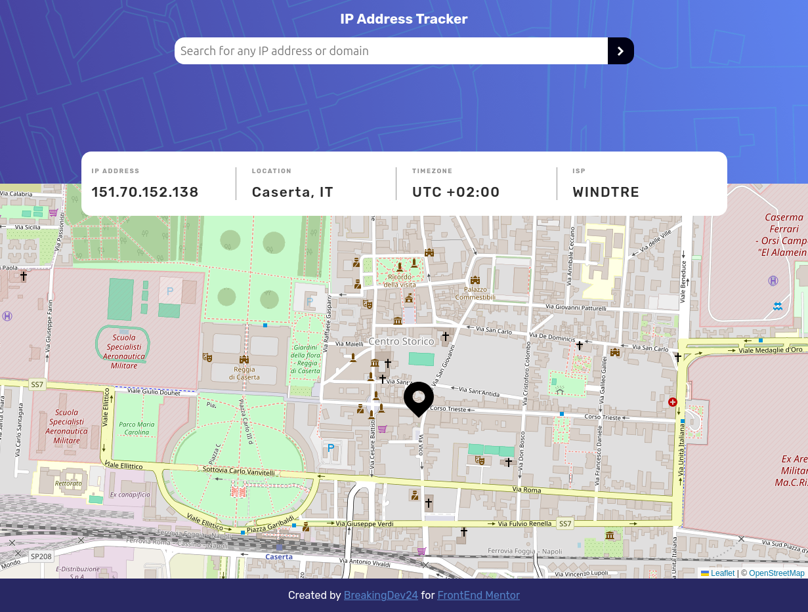

# Frontend Mentor - IP address tracker solution

This is a solution to the [IP address tracker challenge on Frontend Mentor](https://www.frontendmentor.io/challenges/ip-address-tracker-I8-0yYAH0). Frontend Mentor challenges help you improve your coding skills by building realistic projects.

## Table of contents

- [Overview](#overview)
  - [The challenge](#the-challenge)
  - [Screenshot](#screenshot)
  - [Links](#links)
- [My process](#my-process)
  - [Built with](#built-with)
  - [What I learned](#what-i-learned)
- [Author](#author)

## Overview

### The challenge

Users should be able to:

- View the optimal layout for each page depending on their device's screen size
- See hover states for all interactive elements on the page
- See their own IP address on the map on the initial page load
- Search for any IP addresses or domains and see the key information and location

### Screenshot

### Links

- [Solution URL](https://your-solution-url.com)
- [Live Site URL](https://ipaddresstracker-aa.netlify.app/)

## My process

### Built with

- Semantic HTML5 markup
- CSS custom properties
- Flexbox
- CSS Grid
- Mobile-first workflow
- Leaflet.js
- [IP Geolcation API](https://geo.ipify.org/)

### What I Learned

While building this project, I had the opportunity to deepen my understanding of:

- Working with APIs: I used the IP Geolocation API to fetch user location data and learned how to handle async/await logic effectively, especially error handling in network requests.

-Leaflet.js Integration: I explored how to integrate Leaflet with vanilla JavaScript, manage markers dynamically, and customize map views.

- Responsive Design: I enhanced my mobile-first design skills, using CSS Grid and Flexbox together to create a seamless layout across devices.

- Real-world debugging: Implementing IP validation, handling API rate limits, and managing loading states taught me how to think through UX-focused edge cases.

## Author

- [Website -](https://antonioavoliodev.netlify.app/)
